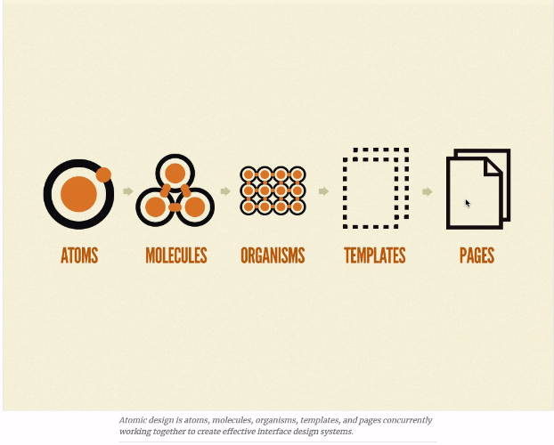
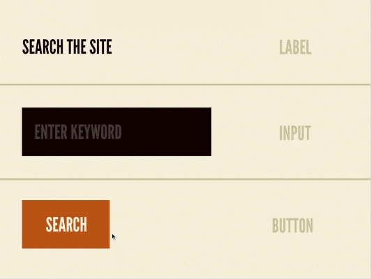
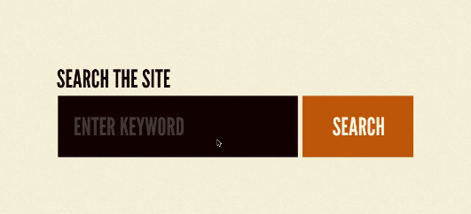
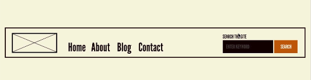
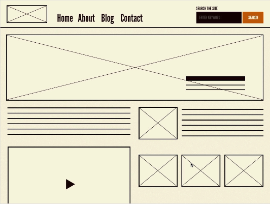

# Introduction to design systems

## What are design systems

A design system is an agreement that defines how a company or a set of people working together would build products. Engineers, designers and product managers use exactly the same components and collaborate together to create a system that could be **consistent across different platforms**.

That goes beyond e.g. buttons, can apply to the language that content creates use to create content (hard / soft tone of all blogs)

A set of agreed upon rules that a group of people can follow to develop products.

**Examples of core principles**

- Experience values
- Accessibility
- Internationalization
- Information architecture

all engineers, product managers have to respect when creating content / software products at the company.

**Some more**

- Color combinations
- Typography
- Illustrations
- Sounds
- Icons

The keyword here is **consistency**

---

## Atomic Design principles

A framework or a way of thinking about design systems.

The idea behind atomic design is breaking down the components or the parts of a design systems into 5 different parts:

- atoms
- molecules
- organisms
- templates
- pages

**Atoms**

An atom can exist on each own. Tiniest pieces of the system.

- label
- input
- button

**Molecules**

Combination of atoms

**Organisms**

A combination of many molecules and atoms together

An organism is a larger structure, it can actually make sense to the user.

- nav bar
- blog post
- footer

**Templates**

A template is a combination of different organisms to actually make sense together.

- Login page
  - form
  - button
  - heading
  - card
  - checkbox
  - forgot your password link

**Page**

The only difference between templates and pages is the data used in it. The template has some fake data, but the page has real life data in it.

---

## Example design systems

- [Carbon design system - IBM](https://carbondesignsystem.com/)
- [Fluent UI - Microsoft](https://developer.microsoft.com/en-us/fluentui#/)

To learn about a design system, you should have a look at the:

- colors
- accessibility guidelines
- typography
- icons
- components
- etc

---

## Your role as engineer in a design system

Your responsibility as an engineer, would be to translate the guidelines of the design system into reusable code that can be used to create products easily.

- Understanding the system
- Extracting reusable functionality out of the system into code
- Represent components of this design system which is reusable along products and strictly respects the guidelines

---
